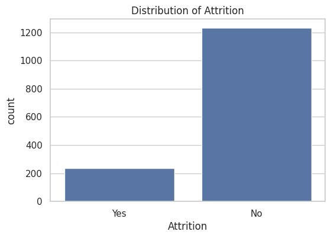
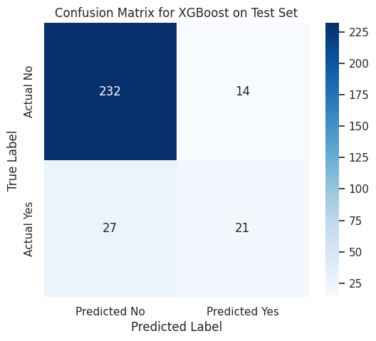
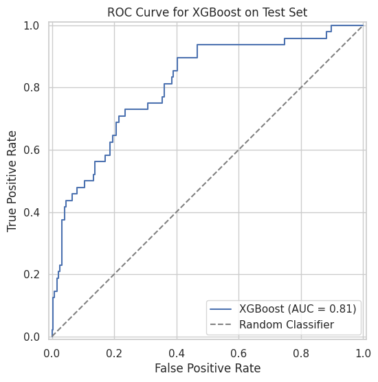
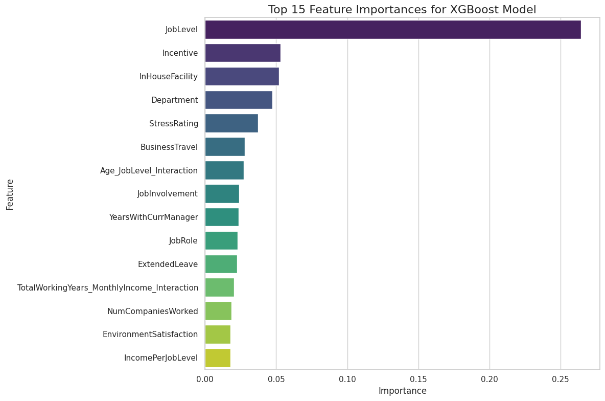
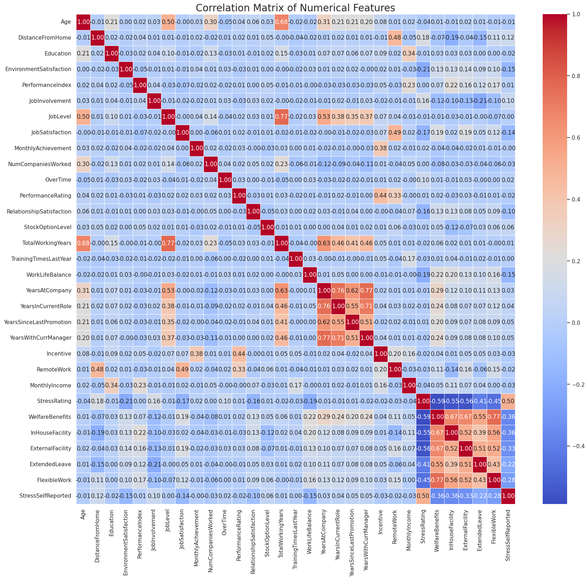

# IBM Employee Attrition Prediction

An end-to-end machine learning analysis for predicting employee attrition risk using IBM HR analytics data. The project combines exploratory data analysis, feature engineering, stratified model validation, and model interpretation to support proactive employee-retention strategy.

## Repository Description

**Suggested GitHub description:**  
Machine learning project for IBM employee attrition prediction using EDA, feature engineering, XGBoost, and retention-focused model evaluation.

## Project Overview

Employee attrition is a strategic workforce-management challenge in technology and consulting organizations. Departures can create project delays, recruitment costs, onboarding burden, and loss of organizational knowledge. This project frames attrition prediction as a supervised binary classification task and evaluates whether employee-level HR attributes can identify individuals with elevated attrition risk.

The notebook follows a complete academic workflow:

- Business context and market motivation
- Exploratory Data Analysis (EDA)
- Target-variable and feature distribution analysis
- Feature engineering and numerical standardization
- Stratified train-test splitting
- Cross-validated model comparison
- Hold-out test evaluation
- Feature-importance interpretation

## Repository Name Options

Recommended:

```text
ibm-employee-attrition-prediction
```

Alternative names:

```text
employee-attrition-risk-model
hr-analytics-attrition-classification
ibm-hr-analytics-retention-model
workforce-attrition-prediction
```

## Dataset

The project uses an IBM HR analytics attrition dataset containing employee demographic, job-role, compensation, satisfaction, tenure, and workplace-condition variables. The target variable is:

```text
Attrition
```

The target is converted into a binary classification label:

- `1`: Employee attrited
- `0`: Employee did not attrit

## Methodology

### 1. Exploratory Data Analysis

The analysis begins by inspecting dataset shape, feature types, missing values, target imbalance, numerical distributions, categorical frequencies, and feature relationships with attrition.



### 2. Feature Engineering

Several preprocessing and transformation steps are applied:

- Low-information fields are removed, including constant or identifier-like columns.
- Categorical variables are label-encoded.
- Numerical features are standardized using `StandardScaler`.
- Interaction and ratio features are created, including:
  - `IncomePerJobLevel`
  - `YearsWithManagerRatio`
  - `Age_JobLevel_Interaction`
  - `TotalWorkingYears_MonthlyIncome_Interaction`

### 3. Model Training and Validation

The project compares three candidate classifiers using stratified 5-fold cross-validation:

- Logistic Regression
- LightGBM
- XGBoost

Because employee attrition is class-imbalanced, model selection emphasizes F1-score and ROC AUC rather than accuracy alone.

## Model Performance

### Cross-Validation Results

| Model | Average ROC AUC | Average F1-score |
|---|---:|---:|
| Logistic Regression | 0.8222 (+/- 0.0250) | 0.4858 (+/- 0.0198) |
| LightGBM | 0.8103 (+/- 0.0279) | 0.4870 (+/- 0.0449) |
| XGBoost | 0.8008 (+/- 0.0199) | 0.4994 (+/- 0.0377) |

XGBoost was selected because it achieved the strongest average F1-score across validation folds.

### Hold-Out Test Results

| Metric | Value |
|---|---:|
| Accuracy | 0.8605 |
| Precision for attrition | 0.6000 |
| Recall for attrition | 0.4375 |
| F1-score for attrition | 0.5060 |
| ROC AUC | 0.8092 |





## Key Insights

- The dataset is imbalanced, so accuracy alone is not sufficient for evaluating attrition prediction.
- XGBoost achieved the best F1-score among the tested models, making it the preferred model for balancing precision and recall.
- The model correctly identified 21 attrition cases in the hold-out test set but missed 27 actual attrition cases, suggesting that recall-oriented threshold tuning may be useful for a retention-focused deployment.
- Important predictive signals include job seniority, incentives, workplace facilities, department, stress level, business travel, and engineered interaction features.
- Feature importance should be interpreted as predictive association, not causal proof.



## Correlation Analysis

The correlation heatmap helps identify relationships among numerical predictors and potential redundancy in the feature space.



## Repository Structure

```text
.
|-- README.md
|-- OmniCampus25UGM_FarhanAP.ipynb
|-- OmniCampus25UGM_FarhanAP.pdf
|-- data._finalprojectcsv.csv
|-- assets/
|   |-- target-attrition-distribution.png
|   |-- correlation-heatmap.png
|   |-- confusion-matrix.png
|   |-- roc-curve.png
|   `-- feature-importance.png
`-- .gitignore
```

## How to Run

1. Clone the repository.
2. Open `OmniCampus25UGM_FarhanAP.ipynb` in Google Colab or Jupyter Notebook.
3. Install or import the required Python libraries:

```python
pandas
numpy
matplotlib
seaborn
scipy
scikit-learn
lightgbm
xgboost
```

4. Ensure the dataset path in the notebook points to the CSV file.
5. Run the notebook cells from top to bottom.

## Tools and Libraries

- Python
- pandas
- NumPy
- Matplotlib
- Seaborn
- SciPy
- scikit-learn
- LightGBM
- XGBoost

## Academic Notes

This project was developed as part of the **Global Consumer Intelligence Short Course - Data Science & Business**, offered by **The University of Tokyo** and **Matsuo-Iwasawa Laboratory**. It is intended as an academic machine learning case study that demonstrates how HR analytics can be used to explore employee attrition patterns, evaluate predictive models, and translate model outputs into business insights. The results should not be used for high-stakes employee decisions without additional validation, fairness review, threshold calibration, privacy assessment, and domain-expert oversight.

## Author

Farhan A. P.

